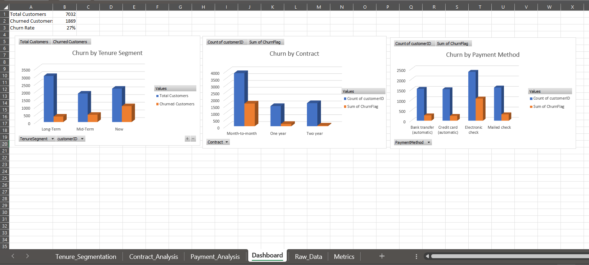

# 📊 Customer Churn Analysis Dashboard

## 🔍 Project Overview
This project focuses on analyzing **customer churn behavior** using **Microsoft Excel**.  
The goal is to identify key churn drivers and present insights through **KPIs, Pivot Tables, and an interactive dashboard**, similar to industry-style business analytics reporting.

The dashboard enables stakeholders to quickly understand:
- Overall churn performance
- Churn patterns across tenure segments
- Impact of contract type and payment method on churn

---

## 🧰 Tools & Techniques Used
- Microsoft Excel
- Data Cleaning & Preparation
- Excel Formulas (`IF`, `COUNTIF`, `COUNTA`)
- Pivot Tables & Calculated Metrics
- Bar Charts & Dashboard Design

---

## 📁 Project Structure
```

CUSTOMER-CHURN/
│
├── dashboards/
│   ├── churn_dashboard_requirements.txt
│   └── Customer Churn Dashboard.xlsx
│
├── data/
│   ├── raw_customer_data.csv
│   └── cleaned_customer_data.csv
│
├── images/
│   ├── raw_data_sheet.png
│   ├── metrics_sheet.png
│   ├── tenure_pivot.png
│   ├── contract_pivot.png
│   ├── payment_pivot.png
│   └── dashboard.png
│
├── notebooks/
│   ├── 01_data_cleaning.ipynb
│   ├── 02_eda.ipynb
│   ├── 03_segmentation.ipynb
│   └── 04_insights_decisions.ipynb
│
├── sql/
│   └── churn_analysis.sql
│
├── README.md
└── requirements.txt

```

---

## 📄 Sheet-wise Explanation

### 1️⃣ Raw_Data Sheet
Contains the cleaned customer-level dataset used for analysis.

**Key Columns:**
- CustomerID  
- Tenure  
- TenureSegment (New / Mid-Term / Long-Term)  
- Contract  
- PaymentMethod  
- ChurnFlag (0 = No, 1 = Yes)

📷 *Preview:*  


---

### 2️⃣ Metrics Sheet (KPIs)
Provides high-level churn KPIs calculated using Excel formulas.

**KPIs Included:**
- Total Customers
- Churned Customers
- Churn Rate (%)

📷 *Preview:*  


---

### 3️⃣ Tenure_Segmentation Sheet
Pivot table analysis showing churn behavior across customer tenure segments.

**Insights:**
- New customers show the highest churn
- Long-term customers have lower churn rates

📷 *Preview:*  


---

### 4️⃣ Contract_Analysis Sheet
Analyzes churn based on contract type.

**Insights:**
- Month-to-month contracts exhibit higher churn
- Long-term contracts improve retention

📷 *Preview:*  


---

### 5️⃣ Payment_Analysis Sheet
Evaluates churn patterns across payment methods.

**Insights:**
- Electronic check users have higher churn
- Automatic payment methods show better retention

📷 *Preview:*  


---

## 📊 Final Dashboard
A single-page executive dashboard summarizing all insights with:
- KPI cards
- Churn comparison charts
- Clean, presentation-ready layout

📷 *Dashboard Preview:*  


---

## 📌 Key Business Insights
- Overall churn rate is significantly influenced by **tenure length**
- **New and short-tenure customers** require early engagement strategies
- **Contract type and payment method** play a major role in churn behavior

---

## 📥 How to Use
1. Download `Customer_Churn_Dashboard.xlsx`
2. Open using Microsoft Excel
3. Navigate to the **Dashboard** sheet
4. Interact with pivot tables and charts

---

## 👩‍💻 Author
**Mehak Tewari**  
Specialization: **AI & ML | Full Stack Development | Software Engineering**

📧 Email: [mehaktewari07@gmail.com](mailto:mehaktewari07@gmail.com)  
🔗 LinkedIn: [Mehak Tewari](https://www.linkedin.com/in/mehak-tewari-04934b247/)

---

## ⭐ If you like this project
Feel free to ⭐ star the repository or connect with me on LinkedIn!
```

---

